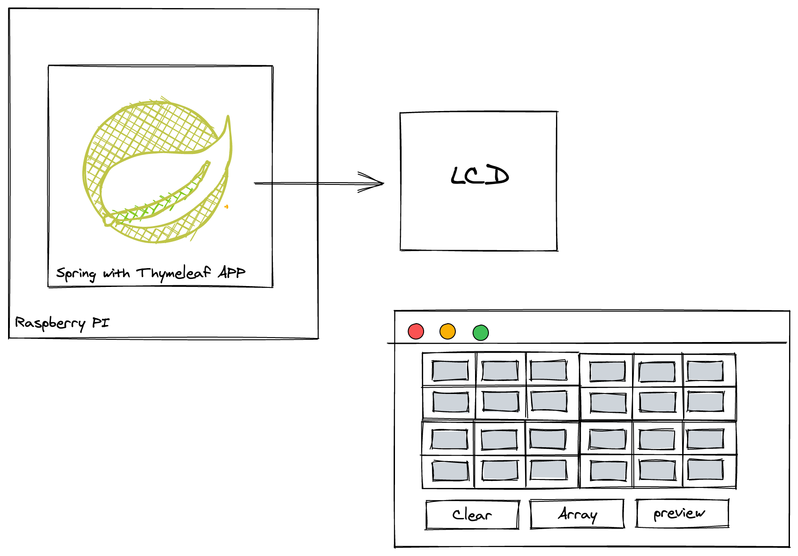

# LCD ST7920 Spring boot Thymeleaf demo

A simple Spring Boot Thymeleaf app where it shows a form with a 128x64 table. Each table position is the representation of the LCD graphic display. I created an Array of bits with all positions of this table.


### Deploy

```
mvn clean package spring-boot:repackage
```


# rum

```
java -jar target/spring-boot-thymeleaf-view-example-0.0.1-SNAPSHOT.jar
```


```
mvn spring-boot:run
```

- [Blog post](http://www.igfasouza.com/blog)




